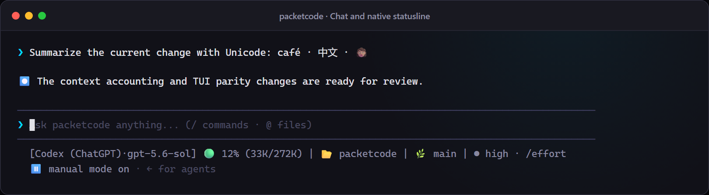
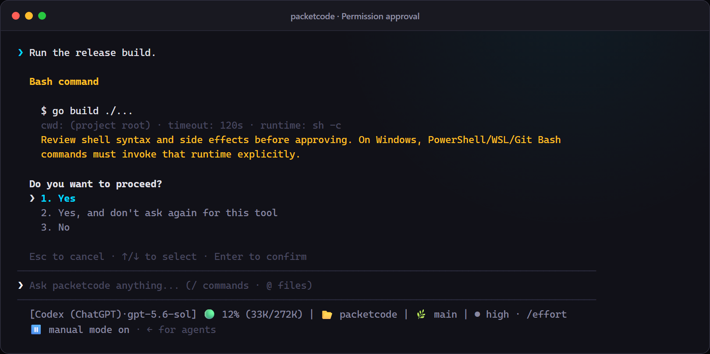
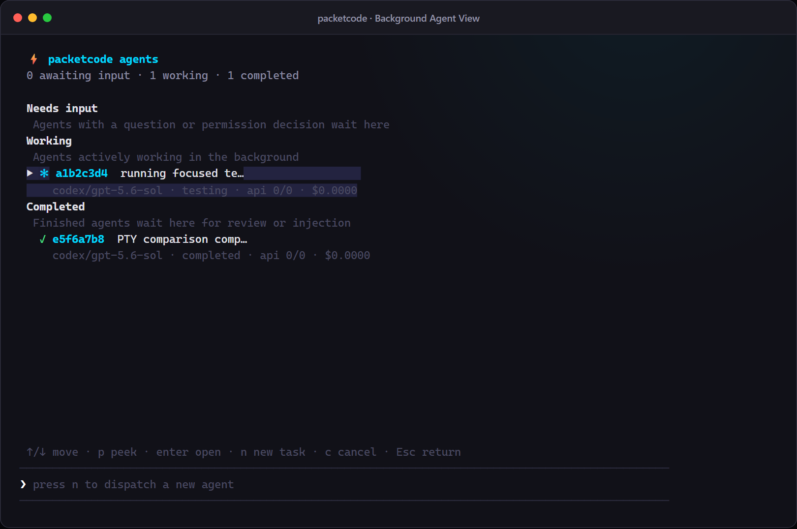

# packetcode

A keyboard-first, multi-provider coding agent for the terminal, with a Claude Code-inspired TUI and first-class OpenAI Codex subscription support.

> Status: pre-1.0 and under active development. Documentation describes the current `main` branch.

packetcode keeps the conversation, tools, approvals, background agents, and workflows in one terminal interface. It can inspect and edit the current project, execute commands, delegate work, connect to MCP tools, and use hosted or local models without routing through OpenCode.

## Interface

<p align="center">
  
</p>

Permission-aware tool execution and the full background Agent workspace:

<p align="center">
  <a href="docs/images/packetcode-approval.png"></a>
  <a href="docs/images/packetcode-agents.png"></a>
</p>

These screenshots are rendered from the deterministic TUI fixtures used by
the release-gating terminal test suite.

## Install

Install the latest macOS or Linux release:

```bash
curl -fsSL https://raw.githubusercontent.com/packetloss404/packetcode/main/install.sh | bash
```

Install without `sudo`:

```bash
curl -fsSL https://raw.githubusercontent.com/packetloss404/packetcode/main/install.sh | INSTALL_DIR="$HOME/.local/bin" bash
```

Install the latest checksum-verified Windows release:

```powershell
& ([scriptblock]::Create((Invoke-WebRequest https://raw.githubusercontent.com/packetloss404/packetcode/main/install.ps1).Content))
```

The Windows installer defaults to
`%LOCALAPPDATA%\Programs\PacketCode\bin` and does not silently modify `PATH`.
PacketADE also checks that documented location.

Build from source with Go 1.24.2 or newer:

```bash
make build
./bin/packetcode
```

Windows:

```powershell
$commit = git rev-parse --short HEAD
go build -trimpath -ldflags "-s -w -X main.version=dev -X main.commit=$commit" -o bin/packetcode.exe ./cmd/packetcode
.\bin\packetcode.exe
```

The first run asks for a provider, API key when required, and model, then writes
`~/.packetcode/config.toml` with user-only permissions. Set an absolute
`PACKETCODE_HOME` to isolate all PacketCode configuration and state in another
data directory.

To connect the built-in Sugar provider and pull its live Conduit/direct-model catalog:

```text
packetcode sugar login --server https://your-sugar-service.up.railway.app --name your-name
```

Packetcode opens Sugar's approval page and prints the same short code in the terminal. Sign in as yourself, confirm the code and device name, then approve. Packetcode polls at Sugar's required interval, saves the member-owned revocable key with user-only file permissions, and pulls the live catalog. Add `--no-browser` when you want to open the printed URL manually.

Sugar defaults to `sugar/conduit`; `/model` can pin any model Sugar currently supplies.

## Providers

| Slug | Authentication | Notes |
| --- | --- | --- |
| `sugar` | Member-approved device sign-in | Live Conduit and direct-model catalog from the private Sugar service. |
| `codex` | Existing Codex CLI ChatGPT login | Reuses `~/.codex/auth.json`; no API key. |
| `openai` | API key | OpenAI API. |
| `anthropic` | API key | Anthropic Messages API. |
| `gemini` | API key | Google Gemini API; independent of Gemini CLI login. |
| `minimax` | API key | MiniMax OpenAI-compatible API; MiniMax M3 default. |
| `deepseek` | API key | DeepSeek OpenAI-compatible API. |
| `grok` | xAI API key | xAI API; packetcode does not reuse the consumer Grok subscription login. |
| `mistral` | API key | Mistral API, including Devstral and Codestral models. |
| `openrouter` | API key | OpenRouter model catalog and routing. |
| `ollama` | None | Native Ollama API; defaults to `localhost:11434`. |
| Custom | Optional | Any configured OpenAI-compatible endpoint. |

The `codex` provider is the zero-key path for an OpenAI Codex ChatGPT subscription. Run `codex login`, choose **Sign in with ChatGPT**, then start packetcode with `--provider codex` or select Codex in the provider picker.

See [Providers and models](docs/providers.md) for authentication, model discovery, local Ollama, and custom endpoints.

## SSH Packet Computers

PacketCode can use a registered SSH server as the foreground project
workspace. First verify the server's host-key fingerprint through a trusted
channel, then register it from a normal PacketCode session:

```text
/computers ssh production deploy@example.com /srv/apps/widget --fingerprint SHA256:... --identity ~/.ssh/id_ed25519
```

Start a new remote session:

```bash
packetcode --computer production --provider minimax --model MiniMax-M3
```

The process keeps one pinned SSH connection and SFTP client open. Reading,
searching, listing, writing, patching, and shell commands operate inside the
registered remote root; command `cwd` values remain root-confined. SSH agent
authentication works on Unix and with the Windows OpenSSH agent pipe; explicit
unencrypted identity files and conventional `~/.ssh` keys are also supported.

Remote background agents and workflows are available for process-lifetime
server engineering. A remote foreground session inherits its active computer;
from a local session use `/spawn --computer production ...` or `/workflows run
--computer production review`. Every remote job owns an SSH connection, and a
write job fails closed unless it can create an isolated remote Git worktree.

This is not daemon durability: closing PacketCode does not reconnect or resume
agent loops and cannot guarantee supervision of detached remote descendants.
Remote `/undo`, code-intelligence tools, `@file` expansion, project hooks, and
live heartbeat/status remain unavailable.
See [Packet Computers](docs/feature-packet-computers.md) for security details
and exact boundaries.

## Terminal Workflow

Type a prompt and press `Enter`; use `Ctrl+J` or `\` then `Enter` for a portable newline. `Alt+Enter` also works when the terminal reports Alt distinctly. `Shift+Enter` works only where the terminal maps it to `Ctrl+J`; true shifted-key reporting is reserved for the Bubble Tea v2 migration. Finalized turns are committed to native terminal scrollback while the active response remains in a small live region.

| Key | Action |
| --- | --- |
| `Enter` | Send a prompt. |
| `Ctrl+J` / `\` then `Enter` | Insert a portable newline; `Alt+Enter` also works when Alt is reported distinctly. |
| `Up` / `Down` | Recall prompt history at the first/last input line. |
| `Shift+Tab` | Cycle Manual → Accept Edits → Auto → Plan, including during an active turn. |
| `Left` on an empty idle prompt | Open Agent View. |
| `Ctrl+P` | Open the provider picker. |
| `/model` | Open the model picker; `Alt+M` also works when Alt is reported distinctly. |
| `Ctrl+C` | Cancel the active turn, clear a draft, or quit from an empty prompt. |
| `Ctrl+D` | Quit from an empty prompt. |
| `Ctrl+L` | Clear the visible transcript without deleting the session. |

If a prompt is submitted during an active turn or compaction, packetcode queues it and runs it afterward. `/queue` lists queued prompts; `/queue drop <n>` and `/queue clear` manage them.

Typing `@` at a token boundary opens project-file completion. The selected `@path` is expanded into bounded, root-scoped file context when the prompt is sent. `@file` expansion is disabled for SSH Packet Computer sessions; use `read_file` there. Typing `/` opens slash-command completion.

## Permission Modes

The mode footer always shows the effective policy:

- **Manual** (`ask`): read-only tools run; edits, commands, MCP tools, and agent spawns ask.
- **Accept Edits** (`accept_edits`): file writes and patches run; shell, MCP, and agent spawns ask.
- **Auto** (`auto`): file edits and shell commands run; MCP and other approval-gated surfaces still ask.
- **Plan** (`read_only` plus plan instruction): research only; mutating tools are denied.
- **Bypass Permissions** (`bypass`): tools run unless an explicit deny rule matches. Enter deliberately with `/trust on` or `--trust`; it is not part of the forward cycle.

Shift+Tab can change mode while a turn is running. The new policy applies to subsequent tool actions and re-evaluates an approval already on screen. A command that has already started is not interrupted.

The approval menu supports arrow keys and numbers:

1. Yes
2. Yes, and do not ask again for this tool/session rule
3. No

Use `/permissions` to inspect or change the session policy. `/permissions reset`
revokes remembered/session rules and restores the startup policy. See
[Security and permissions](docs/security.md).

## Background Agents and Workflows

`/spawn <prompt>` starts a read-only background agent. `/spawn --write <prompt>` creates an isolated git worktree before allowing writes or commands. Use `--computer <name>` from a local session; remote sessions inherit their active computer. Write jobs never edit the foreground checkout directly.

`/agents` opens the full-screen Agent workspace. It groups agents by needs-input, working, and completed states; supports task entry directly from the bottom prompt; and exposes peek, transcript, cancel, inject, and ignore actions. Results are not silently added to foreground context.

`/workflows` orchestrates sequential phases and parallel fan-out over the same bounded jobs manager. A built-in review is available immediately:

```text
/workflows run review
/workflows run --computer production review
/workflows run review target="the staged diff"
/workflows validate review
/workflows list
/workflows stop all
```

User workflows live in `~/.packetcode/workflows/*.toml`; local project workflows live in `.packetcode/workflows/*.toml` and take precedence. Remote sessions load built-ins and local user definitions; loading project definitions over SFTP is deferred so the TUI never blocks on workflow discovery.
Workflow TOML is schema-versioned. Optional step verifiers use a fail-closed
structured verdict and bounded retries; verifier jobs and retries count toward
the same agent and token budgets. See [Workflows](docs/workflows.md).

`/loop` repeats normal prompts or slash commands:

```text
/loop Review the current change and continue until complete
/loop 10m /workflows run review
/loop list
/loop stop all
```

Self-paced loops stop on a versioned `packetcode-loop-decision` block or the
legacy `LOOP_DONE` sentinel, and always stop after 25 iterations. Interval
loops run immediately, then on the requested interval; they queue rather than
overlap an active foreground turn.

See [Background agents](docs/feature-background-agents.md) and [Agent View](docs/feature-agent-view.md).

## Slash Commands

| Command | Purpose |
| --- | --- |
| `/provider [add [slug]\|slug]` | Open the provider picker, add/update a key, or switch. |
| `/model [id]` | Open the model picker or switch models. |
| `/effort [default\|low\|medium\|high\|xhigh\|max\|ultra]` | Show or set reasoning effort for models that expose it. |
| `/spawn [--computer <name>] [--write] <prompt>` | Start a local or remote background agent. |
| `/agents [id]` | Open Agent View or one transcript. |
| `/jobs [id]` | List jobs or open one transcript. |
| `/jobs resubmit [id]` | Re-run a job abandoned by a previous app exit (new job; the original is not resumed). |
| `/cancel <id\|all>` | Cancel background jobs. |
| `/computers` | List registered Packet Computers. |
| `/computers status <name>` | Show one computer's stored record. |
| `/computers register <name> <root>` | Register a local computer record. |
| `/computers ssh <name> <user@host> <root> --fingerprint <SHA256:...>` | Register a pinned SSH computer. |
| `/computers remove <name> --yes` | Remove a computer record. |
| `/workflows [run [--computer <name>] <name>\|validate <name>\|list\|stop [id\|all]\|<id>]` | Validate, run, and inspect local or remote workflows. |
| `/loop [interval] <prompt\|/command>` | Repeat work; use `list` or `stop`. |
| `/plan [on\|off]` | Toggle read-only planning mode. |
| `/queue [drop <n>\|clear]` | Inspect or manage queued prompts. |
| `/sessions` | List, resume, rename, or delete sessions. |
| `/compact [--keep N]` | Summarize older context. |
| `/undo` | Restore the latest file backup. |
| `/cost` | Show or reset tracked API cost. |
| `/permissions` | Inspect or change tool policy; `reset` revokes session rules. |
| `/trust [on\|off]` | Show or set bypass mode. |
| `/ollama [status\|models\|ps\|pull <model>]` | Inspect and manage local/remote Ollama. |
| `/mcp` | Inspect MCP servers, status, tools, and logs. |
| `/statusline [refresh]` | Show or refresh statusline output. |
| `/transcript` | Open the current saved transcript. |
| `/clear` | Clear visible output only. |
| `/help` | Show all keys and commands. |
| `/exit` / `/quit` | Exit packetcode. |

Unknown commands show an error. Prefix a prompt with `//` to send a literal leading slash.

Markdown prompt commands can be installed at `~/.packetcode/commands/<name>.md` or `.packetcode/commands/<name>.md`. Project commands override user commands; built-ins cannot be shadowed.

## Configuration

Minimal hosted configuration:

```toml
[default]
provider = "codex"
model = "gpt-5.6-sol"

[providers.codex]
default_model = "gpt-5.6-sol"

[behavior]
auto_compact_threshold = 80
background_max_concurrent = 4
background_max_depth = 2
background_max_total = 32
background_token_budget = 0
workflow_token_budget = 0

[permissions]
profile = "ask"
```

Zero-config local Ollama defaults to `http://localhost:11434` and automatically selects a bounded `num_ctx`, detects model/tool metadata, and keeps the loaded model warm:

```toml
[default]
provider = "ollama"
model = "qwen2.5-coder:14b"

[providers.ollama]
default_model = "qwen2.5-coder:14b"
```

API keys may be stored in config or provided as `PACKETCODE_<SLUG>_API_KEY`. Environment variables win. See the [full configuration reference](docs/configuration.md).

## Context and Token Use

The statusline context gauge shows current request occupancy, not cumulative billed tokens. Cumulative usage still drives cost. Automatic compaction includes system prompts and tool-schema estimates, preserves complete recent tool exchanges, and records compaction usage.

To reduce repeated context:

- Older oversized tool results are compacted only in the model-facing copy; the complete result remains in the session and UI.
- Code-intelligence defaults are bounded.
- Anthropic requests mark stable system/tool prefixes for ephemeral prompt caching.
- Background jobs and workflows can use token budgets.

## MCP, Hooks, Themes, and Statusline

- MCP servers are external stdio processes configured under `[mcp.<name>]`; discovered tools use `<server>__<tool>` names and remain policy-gated.
- Streamable HTTP is not enabled. Its reviewed v1 trust contract now pins exact
  origins/address classes, bounded bodyless same-origin redirects and atomically
  bound target-only credential rules, disabled ambient proxies, system-root
  TLS, bounded resources,
  credential-bound untrusted output provenance/redaction, per-call approval,
  revocation, and manual failure recovery before a transport implementation can
  land.
- Hooks run on user prompt submission, before a tool, or after a tool.
- A native Claude Code-style statusline is enabled by default. A custom command can consume a Claude-compatible JSON snapshot.
- `~/.packetcode/theme.toml` overrides semantic colors and provider colors.

See [MCP servers](docs/mcp.md), [Hooks and statusline](docs/hooks-and-statusline.md), and [Theming](docs/feature-theming.md).

## Documentation

- [Maintainer handoff](HANDOFF.md)
- [User manual](docs/manual.md)
- [Advanced guide](docs/advanced-guide.md)
- [Terminal cheat sheet](docs/cheat-sheet.md)
- [Offline HTML5 manual](docs/packetcode-manual.html)
- [Getting started](docs/getting-started.md)
- [Providers and models](docs/providers.md)
- [Configuration reference](docs/configuration.md)
- [Security and permissions](docs/security.md)
- [Background agents](docs/feature-background-agents.md)
- [Agent View](docs/feature-agent-view.md)
- [Workflows and verification](docs/workflows.md)
- [Code intelligence](docs/code-intelligence.md)
- [MCP servers](docs/mcp.md)
- [Streamable HTTP MCP trust contract](docs/mcp-http-trust-contract.md)
- [Hooks and statusline](docs/hooks-and-statusline.md)
- [Troubleshooting](docs/troubleshooting.md)
- [TUI parity harness](docs/tui-parity-harness.md)
- [Supported terminals](docs/supported-terminals.md)
- [Packet Computers registry](docs/feature-packet-computers.md)
- [Backlog](BACKLOG.md)
- [Packet Computers and Packet Control proposal](PACKETCOMPUTERS.md) — product
  definition and the full six-phase arc. Packet Control is implemented in
  PacketADE, not here; Packet Computers Phases 1–2 are tracked in
  [docs/packet-computers-loop.md](docs/packet-computers-loop.md).

## Development

Before resuming a maintenance session, read [HANDOFF.md](HANDOFF.md) for the
current architecture map, verification baseline, interaction caveats, and
recommended next work.

```bash
make verify
go test ./...
go vet ./...
go test -race -count=1 ./...
make build
make smoke
make tui-snapshots
make tui-golden-check
```

The credential-free `--tui-fixture=<state>` development flag renders deterministic lifecycle states for PTY snapshots without loading config, providers, credentials, sessions, hooks, MCP, or project files.

## License

MIT — see [LICENSE](LICENSE).
